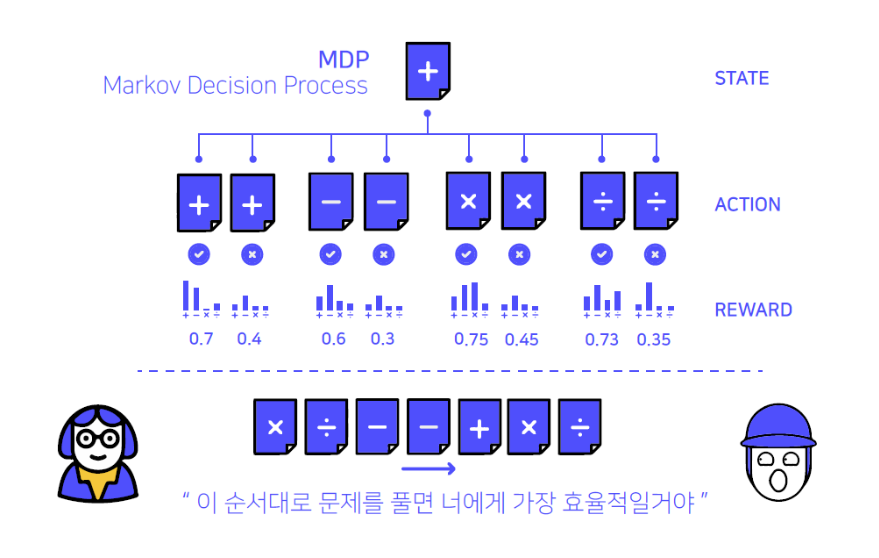
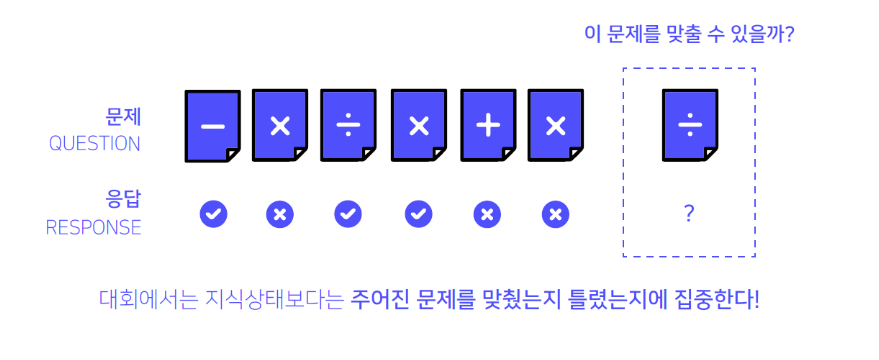
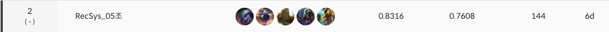
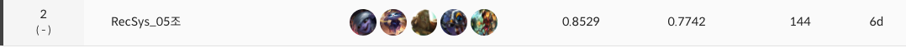
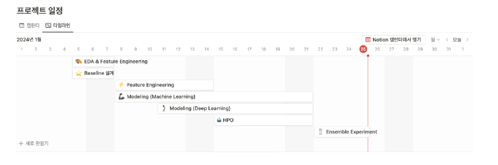
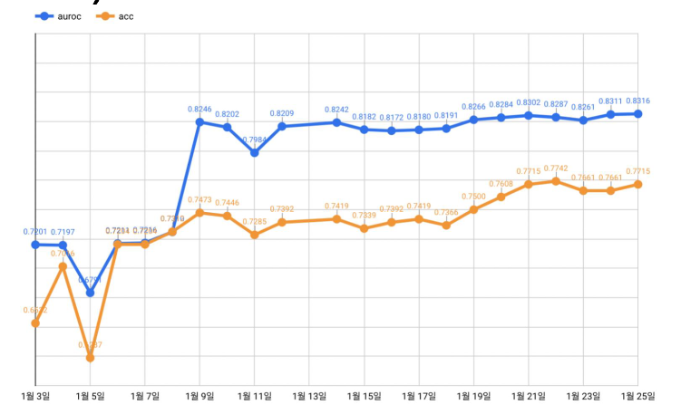

# DKT

## 📌 프로젝트 개요



DKT 란 **우리의 지식상태를 추적하는 딥러닝 밥법** 입니다.

해당 경진대회는 지식상태보다 **주어진 문제를 맞출지 못맞출지 예측하는 대회**입니다.

## 🥈 프로젝트 결과

### Public


### Private


## 📋 프로젝트 수행 절차 및 방법


### EDA
- 사용자 분석
- 문항 별 / 시험지 별 정답률 분석
- 특성 별 빈도 분석
- 특성 별 정답률 분석
- 시험지 대분류 별 정답률 분석
- 시험지 문항 번호 별 정답률 분석
- 문제 풀이 시간에 따른 정답률 분석

### Feature Engineering
위 EDA를 기반으로 다양한 변수 생성.

### Feature Selection
- 과적합 방지를 위해 생성한 변수에 Variance Threshold를 적용하여 분산 임계값을 충족하지 않는 변수를 제거함.

```python
from sklearn.feature_selection import VarianceThreshold

selector = VarianceThreshold(0.8)
train_thres = selector.fit(X_train)
select_feat = train_thres.get_feature_names_out()
```

### 모델링
- LSTM
- GRU
- LSTMAttention
- GRUAttention
- LightGCN
- LightGCN Transformer
- Last Query Transformer
- SAINT+
- XGBoost
- CatBoost

### 프로젝트 수행 결과

- 시계열성을 분해하여 변수로 활용한 XGBoost, CatBoost 등 Tree 기반 모델이 가장 우수한 성능을 보여줌
- Last Query Transformer와 SAINT+ 모델 또한 리더보드 기준 AUROC가 0.8 이상으로 우수한 성능을 보여줌

**최종 모델**

| 모델 | XGBoost | CatBoost | Last Query Transformer | SAINT+ |
| --- | --- | --- | --- | --- |
| AUROC (LB) | 0.8302 | 0.8253 | 0.8092 | 0.8042 |
| Accuracy (LB) | 0.7661 | 0.7473 | 0.7366 | 0.7258 |

- 모델의 성능에 따라 가중치를 주어 **0.75 : 0.15 : 0.07 : 0.03**의 비율로 앙상블을 진행

| AUROC (Public) | 0.8316 | 2nd |
| --- | --- | --- |
| AUROC (Private) | 0.8529 | 2nd |



## 🤖 팀원
<table align="center">
  <tr height="155px">
    <td align="center" width="150px">
      <a href="https://github.com/kwanok"></a>
    </td>
    <td align="center" width="150px">
      <a href="https://github.com/power16one5"></a>
    </td>
    <td align="center" width="150px">
      <a href="https://github.com/seokulee"></a>
    </td>
    <td align="center" width="150px">
      <a href="https://github.com/jw0112"></a>
    </td>
    <td align="center" width="150px">
      <a href="https://github.com/ksj1368"></a>
    </td>
  </tr>
  <tr height="80px">
    <td align="center" width="150px">
      <a href="https://github.com/kwanok">노관옥</a>
    </td>
    <td align="center" width="150px">
      <a href="https://github.com/power16one5">박경원</a>
    </td>
    <td align="center" width="150px">
      <a href="https://github.com/seokulee">이석규</a>
    </td>
    <td align="center" width="150px">
      <a href="https://github.com/jw0112">이진원</a>
    </td>
    <td align="center" width="150px">
      <a href="https://github.com/ksj1368">장성준</a>
    </td>
  </tr>
</table>
&nbsp;

## 📚 Report & Presentation
[Wrap-up Report (PDF)](./[Boostcamp%20AI%20Tech]%20Level2_DKT_Wrap-Up_Report%20-%20RecSys_05조.pdf)

프로젝트 수행 절차, 방법, 결과, 최종 평가, 팀원별 회고는 wrap-up report에서 더 자세히 확인하실 수 있습니다.

[Presentation (PPT)](./[Boostcamp%20AI%20Tech]%20Level2_DKT%20-%20RecSys_05조.pdf)

프로젝트 결과 발표 자료입니다.


# Environment Setting Guide

서버 할당 후 패키지 관리자 update 및 locale 설정하기.

```bash
$ apt update
$ apt-get update
$ pip install --upgrade pip
$ apt install locales
$ locale-gen en_US.UTF-8
$ update-locale LANG=en_US.UTF-8
```

할당받은 서버에서 pyenv.sh을 실행하면 pyenv가 설치됩니다.

```bash
$ bash pyenv.sh
$ source ~/.bashrc
```

poetry를 설치하고 cache 디렉토리를 변경해주세요.

```bash
$ poetry config cache-dir /data/ephemeral/.cache/pypoetry
```
